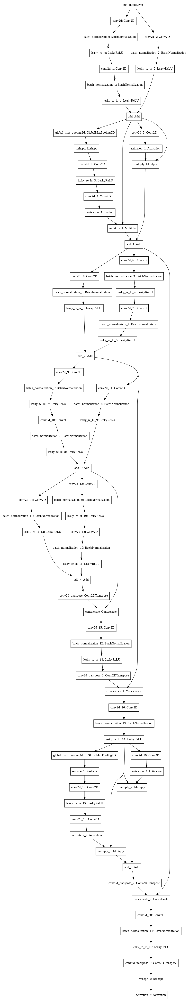

# UNet Remote Sensing

Remote-sensing-based crop mapping implemented using UNet architecture

### U-Net model

The UNet architecture takes 7 bands of Landsat as input and output a one-band image with the same size (width*height). Every pixel in the images are translated to a crop pixel with a value indicating its type.

### Model Training 

The training images and the corresponding output array were reshaped into a specific matrix format, e.g., (batch_size, band_count, width, height, classes) and then mapped pixel by pixel.

### Model Architecture

### Information about the various code files

* config.py file includes some properties like dataset directory, test directory and the colormap.
* make_dataset.py file is used for feature extraction and creating dataset.
* train_model.py contains the UNet Architecture
* utils.py file contains the helper functions
